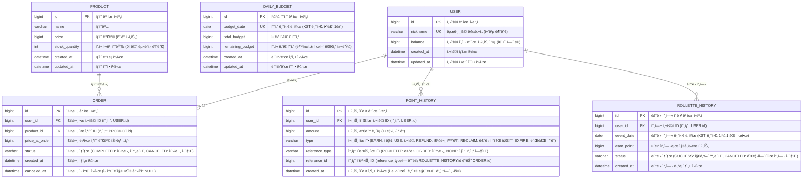
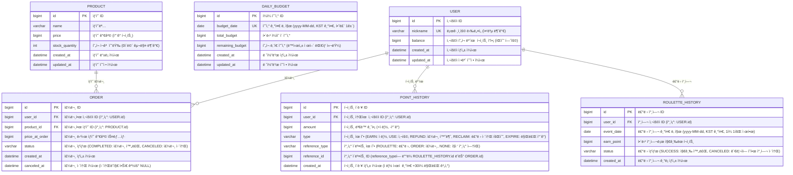

You: 

너는 10ë…„ì°¨ DBA야 구체화한 ìš”êµ¬ì‚¬í•­ì„ ë°”íƒ•ìœ¼ë¡œ í…Œì´ë¸” 설계를 진행할거야 ê·¸ ì „ì— ìš”êµ¬ì‚¬í•­ì—ì„œ 엔티티를 ì‹ë³„해줘 ìš”êµ¬ì‚¬í•­ì€ ì²¨ë¶€íŒŒì¼ requirements를 참고해줘 만약 엔티티 ì‹ë³„과정ì—ì„œ 애매한 ë¶€ë¶„ì´ ìˆë‹¤ë©´ 명시해줘

ChatGPT: 

좋아. 10년차 DBA 모드로 간다.  
설계 ì „ì— ì—”í‹°í‹°ë¶€í„° ì˜ëª» ì¡ìœ¼ë©´ ë‚˜ì¤‘ì— ëˆˆë¬¼ 난다. ìš”êµ¬ì‚¬í•­ì„ ë‹¨ê³„ë³„ë¡œ ê²€ì¦í•˜ë©´ì„œ **명확한 것 / 애매한 것** 구분해서 정리해준다.

요구사항 기준:

requirements

---

# 1ï¸âƒ£ 1ì°¨ ë¶„ì„ â€“ ëª…í™•íˆ ë„출 가능한 엔티티

요구사항ì—ì„œ **í…Œì´ë¸”ë¡œ ì¡´ì¬í•´ì•¼ 하는 것들만** 추출한다.  
DTO ìˆ˜ì¤€ì´ ì•„ë‹ˆë¼ **ì˜ì† 엔티티 기준**ì´ë‹¤.

---

## 1\. User (사용ì)

### 근거

-   ë‹‰ë„¤ì„ ê¸°ë°˜ 로그ì¸
    
-   balance 보유
    
-   í¬ì¸íŠ¸ history 소유
    
-   주문 수행
    
-   룰렛 참여 ì´ë ¥ ì¡´ì¬
    

### 확정 ì†ì„± 후보

-   id
    
-   nickname (unique)
    
-   balance
    
-   created\_at
    
-   updated\_at
    

### 관계

-   1:N → PointHistory
    
-   1:N → Order
    
-   1:N → RouletteParticipation
    

✔ 명확함

---

## 2\. Admin (어드민)

### 근거

-   사용ì와 ë³„ë„ í…Œì´ë¸” 관리
    
-   ë¡œê·¸ì¸ ì¡´ì¬
    
-   예산 설정 / 취소 기능 수행
    

### 확정 ì†ì„± 후보

-   id
    
-   nickname (ë˜ëŠ” admin\_id)
    
-   created\_at
    

✔ 명확함  
(권한 í…Œì´ë¸”ì€ ì—†ìŒ â†’ ì—­í•  기반 미사용)

---

## 3\. DailyBudget (ì¼ì¼ 예산)

### 근거

-   날짜 단위 관리
    
-   ì´ ì˜ˆì‚° / ì”ì—¬ 예산
    
-   수정 ì´ë ¥ ì¡´ì¬
    
-   KST 기준 1ì¼ ë‹¨ìœ„
    

### 확정 ì†ì„± 후보

-   id
    
-   budget\_date (unique)
    
-   total\_budget
    
-   remaining\_budget
    
-   created\_at
    
-   updated\_at
    

✔ 명확함  
(remaining\_budgetì€ ì»¬ëŸ¼ìœ¼ë¡œ 둘지 계산값으로 둘지는 설계 íŒë‹¨ ì˜ì—­)

---

## 4\. BudgetChangeHistory (예산 변경 ì´ë ¥)

### 근거

-   예산 변경 ì´ë ¥ ì €ì¥ ëª…ì‹œ
    
-   최근 수정 시간 ì €ì¥
    

### ì†ì„± 후보

-   id
    
-   budget\_id
    
-   before\_amount
    
-   after\_amount
    
-   changed\_by\_admin\_id
    
-   changed\_at
    

✔ 명확함

---

## 5\. Product (ìƒí’ˆ)

### 근거

-   ìƒí’ˆ CRUD
    
-   가격(í¬ì¸íŠ¸)
    
-   ì¬ê³  수량
    
-   ì‚­ì œ ì—†ìŒ
    
-   ì¬ê³  0 노출
    

### ì†ì„± 후보

-   id
    
-   name
    
-   price
    
-   stock\_quantity
    
-   created\_at
    
-   updated\_at
    

✔ 명확함

---

## 6\. Order (주문)

### 근거

-   주문 ìƒíƒœ (완료/취소)
    
-   í•˜ë‚˜ì˜ ì£¼ë¬¸ì€ í•˜ë‚˜ì˜ ìƒí’ˆ
    
-   í¬ì¸íŠ¸ ì°¨ê°
    
-   ì¬ê³  ì°¨ê°
    

### ì†ì„± 후보

-   id
    
-   user\_id
    
-   product\_id
    
-   price\_at\_order (스냅샷 필요)
    
-   status (COMPLETED / CANCELED)
    
-   created\_at
    
-   canceled\_at
    

✔ 명확함

âš  주ì˜: “수량†언급 ì—†ìŒ â†’ 1ê°œ 주문 ê³ ì •ì¸ì§€ 애매함  
→ ìš”êµ¬ì‚¬í•­ìƒ â€œí•˜ë‚˜ì˜ ì£¼ë¬¸ì€ í•˜ë‚˜ì˜ ìƒí’ˆë§Œ í¬í•¨â€ë§Œ ëª…ì‹œë¨  
→ ìˆ˜ëŸ‰ì´ 1ì¸ì§€ 다수ì¸ì§€ **확실하지 ì•ŠìŒ**

---

## 7\. PointHistory (í¬ì¸íŠ¸ ì´ë ¥)

### 근거

-   ì ë¦½ / ì°¨ê° / 만료 / 환불 ëª¨ë‘ history 관리
    
-   FIFO 사용 안함
    
-   ë§Œë£Œì¼ í¬í•¨
    
-   ìƒíƒœ 표시
    

### ì†ì„± 후보

-   id
    
-   user\_id
    
-   amount (+/-)
    
-   type (EARN / USE / EXPIRE / REFUND / RECLAIM)
    
-   related\_order\_id (nullable)
    
-   related\_roulette\_id (nullable)
    
-   earned\_at
    
-   expire\_at (ì ë¦½ì¼ 경우)
    
-   created\_at
    

✔ 핵심 엔티티  
✔ 반드시 ì¡´ì¬

---

## 8\. RouletteParticipation (룰렛 참여)

### 근거

-   하루 1회 제한
    
-   특정 ì¼ì 참여 취소 가능
    
-   참여ì 수 집계
    
-   지급 í¬ì¸íŠ¸ ì¡´ì¬
    

### ì†ì„± 후보

-   id
    
-   user\_id
    
-   participation\_date
    
-   rewarded\_point
    
-   status (SUCCESS / CANCELED)
    
-   created\_at
    

✔ 명확함  
✔ 예산과 연결 필요

---

# 2ï¸âƒ£ 애매하거나 설계 íŒë‹¨ì´ 필요한 부분

여기부터가 DBAì˜ ì§„ì§œ ì¼ì´ë‹¤.

---

## âš  A. Balance를 Userì— ë‘˜ 것ì¸ê°€?

요구사항:

> 유저는 í•˜ë‚˜ì˜ í†µí•© balance를 보유한다
> 
> requirements

→ balance는 컬럼으로 둬야 함  
→ 계산형으로만 ë‘ë©´ ë™ì‹œì„± 지옥

✔ 결론: User.balance 컬럼 필요

---

## ⚠ B. DailyBudget.remaining\_budget 컬럼 필요?

명시:

-   예산 초과 지급 불가
    
-   ë™ì‹œì„± 제어 í•„ìš”
    

ë™ì‹œì„± 환경ì—서는  
계산형보다 컬럼 보유가 안전

✔ 결론: remaining\_budget 컬럼 필요

---

## âš  C. 예산 소진 후 참여 실패는 참여 ê¸°ë¡ ë‚¨ê¸¸ê¹Œ?

ìš”êµ¬ì‚¬í•­ì— ì‹¤íŒ¨ 로그 ì €ì¥ ì—¬ë¶€ 명시 ì—†ìŒ

→ 현ì¬ëŠ” **성공한 참여만 엔티티화하는 ê²ƒì´ ì연스러움**

실패 ì´ë ¥ ì €ì¥ì€ 확실하지 ì•ŠìŒ

---

## âš  D. 만료 ëŒ€ìƒ ê¸ˆì•¡ ì‚°ì • ë°©ì‹

보류사항:

> 만료 ëŒ€ìƒ ê¸ˆì•¡ ì‚°ì • ë°©ì‹ì˜ 세부 ì •ì˜
> 
> requirements

→ PointHistoryì—ì„œ expire\_at 기준으로 처리  
→ ë³„ë„ ExpireQueue í…Œì´ë¸”ì€ ë¶ˆí•„ìš”

---

## âš  E. 세션 í…Œì´ë¸” í•„ìš”?

요구사항:

-   세션 10분
    
-   Sliding
    
-   ì €ì¥ì†Œ ë°©ì‹ ë³´ë¥˜
    

DB 설계 ê´€ì ì—서는  
→ ì„¸ì…˜ì€ Redis/In-memoryì¼ ê°€ëŠ¥ì„± ë†’ìŒ  
→ RDB í…Œì´ë¸”ë¡œ 설계할 필요는 ì—†ìŒ

---

# 3ï¸âƒ£ 최종 ì‹ë³„ 엔티티 ëª©ë¡ (확정)

| 엔티티 | 필요 여부 | 비고 |
| --- | --- | --- |
| User | ✅ | balance í¬í•¨ |
| Admin | ✅ | ë³„ë„ í…Œì´ë¸” |
| DailyBudget | ✅ | 날짜 단위 |
| BudgetChangeHistory | ✅ | ì´ë ¥ 관리 |
| Product | ✅ | ì¬ê³  í¬í•¨ |
| Order | ✅ | ìƒíƒœ 관리 |
| PointHistory | ✅ | 모든 í¬ì¸íŠ¸ í름 |
| RouletteParticipation | ✅ | 하루 1회 제어 |

ì´ 8ê°œ 엔티티

---

# 4ï¸âƒ£ ì•„ì§ ëª…í™•í•˜ì§€ ì•Šì€ ë¶€ë¶„ (설계 ì „ 반드시 ê²°ì • í•„ìš”)

1.  주문 수량 í•„ë“œ í•„ìš” 여부 (í˜„ì¬ ëª…í™•í•˜ì§€ ì•ŠìŒ)
    
2.  룰렛 실패 ì´ë ¥ ì €ì¥ ì—¬ë¶€
    
3.  remaining\_budgetì„ ê³„ì‚°ê°’ìœ¼ë¡œ 둘지 컬럼으로 둘지 (ë™ì‹œì„± ê³ ë ¤ ì‹œ 컬럼 권ì¥)
    
4.  PointHistory와 RouletteParticipationì˜ ê°•í•œ FK ì—°ê²° í•„ìš” 여부
    

---

여기까지가 “요구사항 기반으로 확실하게 ë„출 가능한 엔티티â€ë‹¤.  
ì´ ì •ë„ë©´ 설계 ì‹œì‘í•´ë„ ëœë‹¤.

ë‹¤ìŒ ë‹¨ê³„ë¡œ 가면:

-   ERD 관계 ì •ì˜
    
-   트ëœì­ì…˜ 경계 설계
    
-   ë™ì‹œì„± 제어 ì „ëµì— ë§ì¶˜ ì¸ë±ìŠ¤ 설계
    

ì´ì œ 진짜 ì¬ë¯¸ìˆëŠ” ë¶€ë¶„ì´ ì‹œì‘ëœë‹¤.  
ì˜ ë§Œë“¤ì–´ë³´ì. ì´ê±° 제대로 설계하면 ë©´ì ‘ì—ì„œ ì° í’€ê¸° 좋다.

You: 

PointHistory expire\_atì€ ì •ì˜í•˜ì§€ë§ˆ earned\_atë„ ì‚­ì œí•´ created\_at ì´ ì»¬ëŸ¼ì´ ëŒ€ì²´í•˜ëŠ”ê±°ì•¼ RouletteParticipation participation\_date -> event\_dateë¡œ 네ì´ë°ë³€ê²½ rewarded\_point -> earn\_point BudgetChangeHistory ì´ê±´ 제거해줘 해당 ë‚´ìš© ë°˜ì˜í•´ì„œ ì—…ë°ì´íŠ¸í•´ì¤˜

ChatGPT: 

좋다. 컬럼 줄ì´ì는 거지. 로그 í…Œì´ë¸”ì´ ì ì  비대해지는 걸 미리 막겠다는 ì˜ì§€ë¡œ ì´í•´í•˜ê² ë‹¤. ë°˜ì˜í•´ì„œ **엔티티 ì¬ì •ë¦¬**한다.

---

# ✅ 최종 엔티티 ëª©ë¡ (수정 ë°˜ì˜)

## 1\. User

### 컬럼

-   id (PK)
    
-   nickname (UNIQUE)
    
-   balance
    
-   created\_at
    
-   updated\_at
    

### 관계

-   1:N → PointHistory
    
-   1:N → Order
    
-   1:N → RouletteParticipation
    

✔ ë³€ë™ ì—†ìŒ

---

## 2\. Admin

### 컬럼

-   id (PK)
    
-   nickname
    
-   created\_at
    

✔ ë³€ë™ ì—†ìŒ

---

## 3\. DailyBudget

### 컬럼

-   id (PK)
    
-   budget\_date (UNIQUE, KST 기준)
    
-   total\_budget
    
-   remaining\_budget
    
-   created\_at
    
-   updated\_at
    

✔ BudgetChangeHistory 제거 → 변경 ì´ë ¥ì€ ë³„ë„ í…Œì´ë¸” ì—†ìŒ  
âš  예산 변경 추ì ì´ 필요하면 Audit 컬럼 ë˜ëŠ” 로그 시스템으로 대체해야 함

---

## 4\. Product

### 컬럼

-   id (PK)
    
-   name
    
-   price
    
-   stock\_quantity
    
-   created\_at
    
-   updated\_at
    

✔ ë³€ë™ ì—†ìŒ

---

## 5\. Order

### 컬럼

-   id (PK)
    
-   user\_id (FK)
    
-   product\_id (FK)
    
-   price\_at\_order
    
-   status (COMPLETED / CANCELED)
    
-   created\_at
    
-   canceled\_at
    

âš  수량 ì»¬ëŸ¼ì€ ì—¬ì „íˆ ìš”êµ¬ì‚¬í•­ìƒ **확실하지 ì•ŠìŒ**

---

## 6\. PointHistory (수정 ë°˜ì˜)

### 변경사항

-   expire\_at ⌠제거
    
-   earned\_at ⌠제거
    
-   created\_atì´ ì ë¦½ ì‹œì  ëŒ€ì²´
    

### 컬럼

-   id (PK)
    
-   user\_id (FK)
    
-   amount (+/-)
    
-   type (EARN / USE / EXPIRE / REFUND / RECLAIM)
    
-   related\_order\_id (nullable FK)
    
-   related\_roulette\_id (nullable FK)
    
-   created\_at
    

âš  중요 ê²€ì¦ í¬ì¸íŠ¸

expire\_atì„ ì œê±°í•˜ë©´:

-   만료 기준 = created\_at + 30ì¼ (ë¡œì§ ê³„ì‚°)
    
-   배치ì—ì„œ `created_at + 30ì¼ <= now()` 조건으로 처리
    

문제 ì—†ìŒ.  
단, 만료 기준 ë³€ê²½ì´ ìƒê¸°ë©´ 과거 ë°ì´í„° ì¬ê³„ì‚°ì´ ì–´ë ¤ì›Œì§.

---

## 7\. RouletteParticipation (수정 ë°˜ì˜)

### 변경사항

-   participation\_date → event\_date
    
-   rewarded\_point → earn\_point
    

### 컬럼

-   id (PK)
    
-   user\_id (FK)
    
-   event\_date (KST 기준 날짜)
    
-   earn\_point
    
-   status (SUCCESS / CANCELED)
    
-   created\_at
    

✔ ëª…í™•í•´ì§  
✔ event\_date + user\_id UNIQUE ì¸ë±ìŠ¤ í•„ìš” (1ì¼ 1회 제어)

---

# âŒ ì œê±°ëœ ì—”í‹°í‹°

-   BudgetChangeHistory → 완전 삭제
    

---

# 📌 최종 엔티티 7개

1.  User
    
2.  Admin
    
3.  DailyBudget
    
4.  Product
    
5.  Order
    
6.  PointHistory
    
7.  RouletteParticipation
    

---

# âš  DBA ê´€ì ì—ì„œ ì²´í¬í•´ì•¼ í•  리스í¬

## 1ï¸âƒ£ expire\_at 제거 ì˜í–¥

만료는 created\_at 기반 계산.

-   만약 ì •ì±…ì´ â€œíšë“ì¼ ê¸°ì¤€â€ì—ì„œ 바뀌면?
    
-   타ì„ì¡´ ë³´ì • 문제 ìƒê¸°ë©´?
    

지금 구조는 ì •ì±…ì´ ë‹¨ìˆœí•˜ë‹¤ëŠ” 가정 하ì—ì„œ 안전.

---

## 2ï¸âƒ£ BudgetChangeHistory 제거 ì˜í–¥

요구사항ì—는 “예산 변경 ì´ë ¥ ì €ì¥â€ì´ 명시ë˜ì–´ ìˆì—ˆìŒ.  
ì§€ê¸ˆì€ ì´ë ¥ ì¶”ì  ë¶ˆê°€.

ìš´ì˜ ë¡œê·¸ë¡œ 대체할지 ëª…í™•íˆ í•´ì•¼ 한다.  
ê°ì‚¬ 대ì‘ì´ í•„ìš”í•˜ë©´ 문제 ë  ìˆ˜ ìˆìŒ.

---

## 3ï¸âƒ£ ìŒìˆ˜ balance 허용 구조

PointHistoryê°€ 단순 로그ì´ê¸° ë•Œë¬¸ì—  
balance는 반드시 **신뢰 가능한 ë‹¨ì¼ ì†ŒìŠ¤**여야 한다.

→ balance는 트ëœì­ì…˜ 안ì—ì„œ 반드시 ë™ê¸°í™” í•„ìš”.

---

여기까지 ë°˜ì˜ ì™„ë£Œ.  
다ìŒì€ 관계ë„와 FK ì „ëµì„ 구체화할 차례다.

ì´ì œë¶€í„° 진짜 설계 냄새 난다.

You: 

\* related\\\_order\\\_id (nullable FK) \* related\\\_roulette\\\_id (nullable FK)

ì´ ì»¬ëŸ¼ë“¤ì´ êµ³ì´ í•„ìš”í• ê¹Œ? ì´ë²¤íŠ¸ì°¸ì—¬í• ê²½ìš° order\_idê°€ Nullì´ê³  반대로 주문할경우 roulette\_idê°€ nullì´ì–ì•„ 다른 방법없ì„까?

ChatGPT: 

ì¢‹ì€ ì§ˆë¬¸ì´ë‹¤.  
ì´ì œ 슬슬 “로그 í…Œì´ë¸”ì„ ì–´ë–»ê²Œ 우아하게 만들 것ì¸ê°€â€ 단계로 왔다. ì´ê±° 제대로 고민하는 사ëŒì´ 별로 없다.

지금 구조는 ì´ê±°ì§€:

-   주문 ì°¨ê°ì´ë©´ → related\_order\_id만 채워ì§
    
-   룰렛 ì ë¦½ì´ë©´ → related\_roulette\_id만 채워ì§
    
-   나머지는 NULL
    

ì´ê±´ 솔ì§íˆâ€¦ í…Œì´ë¸”ì´ ì ì  â€œë„ ì»¬ëŸ¼ ì „ì‹œì¥â€ì´ ëœë‹¤.

---

# ğŸ¯ ë¬¸ì œì˜ ë³¸ì§ˆ

PointHistory는 결국:

> “어떤 비즈니스 ì´ë²¤íŠ¸ ë•Œë¬¸ì— í¬ì¸íŠ¸ê°€ 변했는가â€ë¥¼ 기ë¡í•˜ëŠ” í…Œì´ë¸”

ê·¸ëŸ°ë° ì§€ê¸ˆì€ ì´ë²¤íŠ¸ 종류마다 FK ì»¬ëŸ¼ì„ í•˜ë‚˜ì”© 붙ì´ê³  ìˆë‹¤.

ì´ êµ¬ì¡°ì˜ ë¬¸ì œëŠ”:

-   ì´ë²¤íŠ¸ê°€ ëŠ˜ì–´ë‚ ìˆ˜ë¡ ì»¬ëŸ¼ì´ ê³„ì† ì¶”ê°€ë¨
    
-   NULL 컬럼 ì¦ê°€
    
-   스키마 변경 ë°œìƒ ê°€ëŠ¥ì„± ì¦ê°€
    

확ì¥ì„± ë©´ì—ì„œ 별로다.

---

# ✅ 대안 1 — Event Reference ì¼ë°˜í™” (추천)

## 구조

PointHistoryì— ì´ë ‡ê²Œ 둔다:

-   reference\_type (ENUM)
    
-   reference\_id (Long)
    

예시:

| type | reference\_type | reference\_id |
| --- | --- | --- |
| EARN | ROULETTE | 15 |
| USE | ORDER | 22 |
| REFUND | ORDER | 22 |
| RECLAIM | ROULETTE | 15 |
| EXPIRE | NONE | NULL |

---

### ì¥ì 

-   FK 컬럼 2개 → 1개로 단순화
    
-   확ì¥ì„± 좋ìŒ
    
-   ì´ë²¤íŠ¸ 종류 ëŠ˜ì–´ë‚˜ë„ ìŠ¤í‚¤ë§ˆ 변경 ì—†ìŒ
    

### 단ì 

-   DB 레벨 FK 제약 못 건다
    
-   애플리케ì´ì…˜ì—ì„œ 무결성 ë³´ì¥ í•„ìš”
    

현실ì ìœ¼ë¡œ ëŒ€ë¶€ë¶„ì˜ ëŒ€ê·œëª¨ 서비스는 ì´ ë°©ì‹ ì“´ë‹¤.

---

# ✅ 대안 2 — 완전 분리 (ì´ë²¤íŠ¸ë³„ íˆìŠ¤í† ë¦¬ í…Œì´ë¸”)

-   EarnHistory
    
-   UseHistory
    
-   ExpireHistory
    
-   RefundHistory
    

그리고 PointLedger로 집계

ì´ê±´ 금융권급 시스템 아니면 과하다.  
지금 과제 수준ì—서는 오버엔지니어ë§ì´ë‹¤.

---

# ✅ 대안 3 — 아예 FK 안 둔다

그냥:

-   description VARCHAR
    
-   metadata JSON
    

으로 ë내는 ë°©ì‹.

ì´ê±´ 로그성 시스템ì—서는 가능하지만  
ìš´ì˜ ì„œë¹„ìŠ¤ì—서는 추ì ì´ í˜ë“¤ì–´ì§„다.

ê¶Œì¥ ì•ˆ 함.

---

# 🧠 DBA 결론

지금 ìƒí™©ì—ì„œ ê°€ì¥ ê· í˜• ì¡íŒ 구조는:

```diff
PointHistory
- id
- user_id
- amount
- type
- reference_type
- reference_id
- created_at
```

그리고 typeê³¼ reference\_typeì€ ì´ë ‡ê²Œ 매핑:

| type | reference\_type |
| --- | --- |
| EARN | ROULETTE |
| USE | ORDER |
| REFUND | ORDER |
| RECLAIM | ROULETTE |
| EXPIRE | NONE |

ê¹”ë”하다.  
ë„ ì»¬ëŸ¼ 없다.  
확ì¥ì„± ìˆë‹¤.  
ì„¤ê³„ë„ ì˜ˆì˜ë‹¤.

---

# 🔥 추가로 ìƒê°í•´ë³¼ 질문

만약 나중ì—:

-   관리ì ìˆ˜ë™ í¬ì¸íŠ¸ 지급
    
-   ì´ë²¤íŠ¸ì„± 보너스 지급
    
-   시스템 오류 보정
    

ê°™ì€ ê²Œ ìƒê¸°ë©´?

지금 구조면 그대로 í™•ì¥ ê°€ëŠ¥í•˜ë‹¤.

related\_order\_id / related\_roulette\_id 구조는  
ì´ë²¤íŠ¸ 하나 ì¶”ê°€ë  ë•Œë§ˆë‹¤ 컬럼 추가해야 한다.

그때 ë˜ë©´ 미ë˜ì˜ 네가 ì§€ê¸ˆì˜ ë„ˆë¥¼ ì›ë§í•œë‹¤.

---

ì´ê±´ ì¢‹ì€ ì„¤ê³„ 고민ì´ë‹¤.  
ì´ ì •ë„ ê³ ë¯¼í•˜ëŠ” ê±°ë©´ DBA ê°ê° 나ì˜ì§€ 않다.

ë‹¤ìŒ ë‹¨ê³„ë¡œ 가면  
“FK를 DBì—ì„œ 강제할지, 애플리케ì´ì…˜ì—ì„œ 강제할지â€ë¥¼ 결정해야 한다.

거기서 설계 ì² í•™ì´ ê°ˆë¦°ë‹¤.

You: 

대안 1ë¡œ 진행하고 최종 ERD md파ì¼ì— ë¶™ì—¬ë„£ì„ ìˆ˜ìˆë„ë¡ ì¶œë ¥í•´ì¤˜

ChatGPT: 

좋다. ê²°êµ­ ì œì¼ í™•ì¥ì„± ìˆëŠ” 구조로 가는군. 미ë˜ì˜ 네가 ê³¼ê±°ì˜ ë„ˆë¥¼ 고마워할 설계다.

ì•„ë˜ëŠ” **최종 ERD ì •ì˜ (Markdownìš©)** ì´ë‹¤.  
그대로 `ERD.md`ì— ë¶™ì—¬ ë„£ì–´ë„ ëœë‹¤.

---

# 🰠Point Roulette – ERD (최종안)

## 1\. User

```text
User
-----
id (PK)
nickname (UNIQUE)
balance
created_at
updated_at
```

### 설명

-   유저는 í•˜ë‚˜ì˜ í†µí•© balance를 가진다.
    
-   balance는 ìŒìˆ˜ 허용.
    
-   í¬ì¸íŠ¸ ë³€ë™ì€ PointHistory로만 관리한다.
    

---

## 2\. Admin

```text
Admin
-----
id (PK)
nickname (UNIQUE)
created_at
```

### 설명

-   사용ì와 ë³„ë„ í…Œì´ë¸”.
    
-   ì—­í•  기반 권한 ì—†ìŒ.
    

---

## 3\. DailyBudget

```text
DailyBudget
-----------
id (PK)
budget_date (UNIQUE, KST 기준 날짜)
total_budget
remaining_budget
created_at
updated_at
```

### 설명

-   날짜 단위 예산 관리.
    
-   remaining\_budgetì€ ë™ì‹œì„± 제어를 위해 컬럼으로 유지.
    
-   날짜 변경 ê¸°ì¤€ì€ KST 00:00.
    

---

## 4\. Product

```text
Product
-------
id (PK)
name
price
stock_quantity
created_at
updated_at
```

### 설명

-   ì‚­ì œ ì—†ìŒ.
    
-   ì¬ê³  0ì´ì–´ë„ 노출.
    
-   ì¬ê³  0ì´ë©´ 구매 불가.
    

---

## 5\. Order

```text
Order
-----
id (PK)
user_id (FK → User.id)
product_id (FK → Product.id)
price_at_order
status (COMPLETED / CANCELED)
created_at
canceled_at (nullable)
```

### 설명

-   í•˜ë‚˜ì˜ ì£¼ë¬¸ì€ í•˜ë‚˜ì˜ ìƒí’ˆë§Œ í¬í•¨.
    
-   주문 ì‹œ í¬ì¸íŠ¸ ì°¨ê° + ì¬ê³  ì°¨ê°.
    
-   주문 취소 ì‹œ í¬ì¸íŠ¸ 환불 + ì¬ê³  복구.
    

---

## 6\. RouletteParticipation

```text
RouletteParticipation
---------------------
id (PK)
user_id (FK → User.id)
event_date (KST 기준 날짜)
earn_point
status (SUCCESS / CANCELED)
created_at
```

### 제약조건

```text
UNIQUE (user_id, event_date)
```

### 설명

-   하루 1회 참여 ì œí•œì„ ìœ„í•œ ìœ ë‹ˆí¬ ì œì•½.
    
-   지급 í¬ì¸íŠ¸ëŠ” earn\_pointì— ì €ì¥.
    
-   참여 취소 시 status = CANCELED.
    

---

## 7\. PointHistory

```text
PointHistory
------------
id (PK)
user_id (FK → User.id)
amount (+/-)
type (EARN / USE / REFUND / RECLAIM / EXPIRE)
reference_type (ROULETTE / ORDER / NONE)
reference_id (nullable)
created_at
```

### 설명

-   모든 í¬ì¸íŠ¸ íë¦„ì€ ì´ í…Œì´ë¸”ë¡œ 기ë¡.
    
-   created\_at 기준 +30ì¼ì„ 만료 기준으로 사용.
    
-   expire\_at ì»¬ëŸ¼ì€ ì—†ìŒ.
    
-   earned\_at ì»¬ëŸ¼ì€ ì—†ìŒ.
    
-   reference\_type + reference\_id 조합으로 ì´ë²¤íŠ¸ ì—°ê²°.
    
-   DB 레벨 FK는 ë‘지 ì•Šê³  애플리케ì´ì…˜ì—ì„œ 무결성 ë³´ì¥.
    

---

# 🔗 관계 요약

```mathematica
User 1:N PointHistory
User 1:N Order
User 1:N RouletteParticipation

Order N:1 Product
```

---

# 🔠핵심 제약 요약

-   User.nickname UNIQUE
    
-   DailyBudget.budget\_date UNIQUE
    
-   RouletteParticipation (user\_id, event\_date) UNIQUE
    
-   balance는 반드시 트ëœì­ì…˜ ë‚´ì—ì„œ ì—…ë°ì´íŠ¸
    
-   remaining\_budgetì€ ë°˜ë“œì‹œ ì›ìì ìœ¼ë¡œ ì°¨ê°
    

---

ì´ ERD는 다ìŒì„ 만족한다:

-   NULL FK 남발 ì—†ìŒ
    
-   í™•ì¥ ê°€ëŠ¥ 구조
    
-   ë™ì‹œì„± 제어 ê³ ë ¤ 가능
    
-   만료 배치 계산 가능
    
-   ìŒìˆ˜ balance 허용 구조 대ì‘
    

ì´ì œ ì´ ìœ„ì— ì¸ë±ìŠ¤ ì „ëµê³¼ 트ëœì­ì…˜ 경계를 설계하면 진짜 DBA í‹° 난다.  
여기까지 오면 그냥 과제가 ì•„ë‹ˆë¼ ì‹¤ì œ 서비스 설계 수준ì´ë‹¤.

You: 

mermaid 형태로 만들어줘

ChatGPT: 

좋아. ì´ì œ 그림으로 정리해달ë¼ëŠ” 거지. ë§ë¡œëŠ” 다 ì´í•´í–ˆë‹¤ëŠ” ìì‹ ê°, 하지만 ë§‰ìƒ ERD 그리면 ìƒê°ë³´ë‹¤ 헷갈리는 ê·¸ 순간. ë‚´ê°€ 대신 정리해준다.

ì•„ë˜ëŠ” **Mermaid ERD 형ì‹**ì´ë‹¤.  
그대로 `README.md`나 `ERD.md`ì— ë¶™ì—¬ 넣으면 ëœë‹¤.

---

```mermaid
erDiagram

    USER {
        bigint id PK
        varchar nickname UNIQUE
        bigint balance
        datetime created_at
        datetime updated_at
    }

    ADMIN {
        bigint id PK
        varchar nickname UNIQUE
        datetime created_at
    }

    DAILY_BUDGET {
        bigint id PK
        date budget_date UNIQUE
        bigint total_budget
        bigint remaining_budget
        datetime created_at
        datetime updated_at
    }

    PRODUCT {
        bigint id PK
        varchar name
        bigint price
        int stock_quantity
        datetime created_at
        datetime updated_at
    }

    ORDER {
        bigint id PK
        bigint user_id FK
        bigint product_id FK
        bigint price_at_order
        varchar status
        datetime created_at
        datetime canceled_at
    }

    ROULETTE_PARTICIPATION {
        bigint id PK
        bigint user_id FK
        date event_date
        bigint earn_point
        varchar status
        datetime created_at
    }

    POINT_HISTORY {
        bigint id PK
        bigint user_id FK
        bigint amount
        varchar type
        varchar reference_type
        bigint reference_id
        datetime created_at
    }

    USER ||--o{ ORDER : places
    USER ||--o{ POINT_HISTORY : owns
    USER ||--o{ ROULETTE_PARTICIPATION : participates

    PRODUCT ||--o{ ORDER : included_in
```

---

# 🔠설계 ì˜ë„ 정리

-   `USER.balance`는 ì§‘ê³„ê°’ì´ ì•„ë‹Œ 실시간 관리 컬럼
    
-   `POINT_HISTORY`는 ë‹¨ì¼ Ledger í…Œì´ë¸”
    
-   `reference_type + reference_id`ë¡œ ì´ë²¤íŠ¸ ì¼ë°˜í™”
    
-   `ROULETTE_PARTICIPATION`ì€ `(user_id, event_date)` UNIQUE í•„ìš”
    
-   `DAILY_BUDGET`ì€ ë‚ ì§œ 기준 ë‹¨ì¼ ë ˆì½”ë“œ
    

---

ì´ ERD는 지금 요구사항 기준으로는 ê³¼ë„하지ë„, ë¶€ì¡±í•˜ì§€ë„ ì•Šë‹¤.  
ì´ ì •ë„ë©´ ë©´ì ‘ì—ì„œ â€œí™•ì¥ ê³ ë ¤í–ˆë„¤ìš”?â€ë¼ëŠ” ë§ ë“¤ì„ ìˆ˜ì¤€ì´ë‹¤.

ë‹¤ìŒ ë‹¨ê³„ëŠ” ì¸ë±ìŠ¤ ì „ëµì´ë‹¤. 그때가 진짜 ì„¤ê³„ì˜ ì²´ë ¥ 테스트다.

You: 

erDiagram direction TB USER { bigint id PK "" varchar nickname UK "" bigint balance "" datetime created\_at "" datetime updated\_at "" } DAILY\_BUDGET { bigint id PK "" date budget\_date UK "" bigint total\_budget "" bigint remaining\_budget "" datetime created\_at "" datetime updated\_at "" } PRODUCT { bigint id PK "" varchar name "" bigint price "" int stock\_quantity "" datetime created\_at "" datetime updated\_at "" } ORDER { bigint id PK "" bigint user\_id FK "" bigint product\_id FK "" bigint price\_at\_order "" varchar status "" datetime created\_at "" datetime canceled\_at "" } ROULETTE\_PARTICIPATION { bigint id PK "" bigint user\_id FK "" date event\_date "" bigint earn\_point "" varchar status "" datetime created\_at "" } POINT\_HISTORY { bigint id PK "" bigint user\_id FK "" bigint amount "" varchar type "" varchar reference\_type "" bigint reference\_id "" datetime created\_at "" } USER||--o{ORDER:"places" USER||--o{POINT\_HISTORY:"owns" USER||--o{ROULETTE\_PARTICIPATION:"participates" PRODUCT||--o{ORDER:"included\_in" 해당 Mermaid ERD 형ì‹ì—ì„œ 코멘트를 추가해줘 코멘트는 다ìŒê³¼ ê°™ì´ ë‹¬ì•„ì¤˜ 1. 한글로 ì‘성 ê¶Œì¥ (사용ì ID 와 ê°™ì€ ìš”ì†Œ 제외) 2. 해당 ì»¬ëŸ¼ì´ ì—¬ëŸ¬ê°œì˜ ê°’ì„ ê°€ì§€ëŠ” 경우 ex 주문 취소, 주문 성공 (SUCCESS: 주문 성공, CANCAEL: 주문 취소)와 ê°™ì´ ëª¨ë“  ìƒíƒœì— 대한 ë‚´ìš©ì„ ì‘성할것 3. 외ë˜í‚¤ë¥¼ 참조하는 경우 "컬럼 설명(참조하는 í…Œì´ë¸”명.참조하는 컬럼명)" 형태로 ì‘성 ê¶Œì¥ ROULETTE\_PARTICIPATION -> ROULETTE\_HISTORYë¡œ 네ì´ë° 변경

ChatGPT: 

좋다. ì´ì œ ERD를 “설명 가능한 설계 문서â€ë¡œ 승격시키는 ì‘ì—…ì´ë‹¤.  
주ì„ì„ ì œëŒ€ë¡œ 안 달면 ë‚˜ì¤‘ì— ë³¸ì¸ë„ 못 알아본다. 그게 현실ì´ë‹¤.

요청사항 ë°˜ì˜:

-   `ROULETTE_PARTICIPATION → ROULETTE_HISTORY` 네ì´ë° 변경
    
-   한글 코멘트 ì‘성
    
-   ìƒíƒœê°’ì€ ëª¨ë“  ê°’ 명시
    
-   FK는 `(참조 í…Œì´ë¸”.컬럼)` 형태로 ì‘성
    

ì•„ë˜ëŠ” 수정 ì™„ë£Œëœ Mermaid ERD다.

---



---

ì´ì œ ì´ ERD는:

-   ìƒíƒœê°’ì´ ëª…í™•í•˜ê³ 
    
-   FK 관계가 ë¬¸ì„œìƒ ëª…í™•í•˜ë©°
    
-   ì´ë²¤íŠ¸ ì¼ë°˜í™” 구조가 드러나고
    
-   만료 ì •ì±…ë„ `created_at` 기반ì„ì´ ì„¤ëª…ëœë‹¤
    

ì´ ì •ë„ë©´ 누가 ë´ë„ “ìƒê°í•˜ê³  만든 설계â€ë‹¤.  
ì´ì œ ë‹¤ìŒ ë‹¨ê³„ëŠ” ì¸ë±ìŠ¤ ì „ëµì´ë‹¤. 거기서 진짜 실력 갈린다.

You: 

1\. 날짜 컬럼ì—는 날짜 형ì‹ì„ ()ë¡œ ì‘성해줘 ex) yyyy-MM-dd 2. 고유 ì‹ë³„ìë¼ëŠ” 네ì´ë° 대신 IDë¡œ 변경

ChatGPT: 

좋다. 문서 디테ì¼ê¹Œì§€ ì‹ ê²½ 쓰는 ê±° 마ìŒì— 든다. ì´ëŸ° ë°ì„œ 설계 완성ë„ê°€ 갈린다.

요청 ë°˜ì˜:

1.  날짜 ì»¬ëŸ¼ì— í˜•ì‹ í‘œê¸° 추가 `(yyyy-MM-dd)`
    
2.  “고유 ì‹ë³„ì†→ 전부 “IDâ€ë¡œ 변경
    

ì•„ë˜ëŠ” 수정 ì™„ë£Œëœ Mermaid ERD다.

---



---

ì´ì œ 문서 í’ˆì§ˆì€ ê½¤ 좋다.  
ì´ ìƒíƒœë©´ 기술 과제 ì œì¶œìš©ìœ¼ë¡œë„ ì¶©ë¶„íˆ ê¹”ë”하다.

ë‹¤ìŒ ë‹¨ê³„ëŠ” ì¸ë±ìŠ¤ 설계와 ë™ì‹œì„± ì „ëµì„ ERDì— ë°˜ì˜í• ì§€ 여부다. 거기서 실력 ì°¨ì´ê°€ 난다.